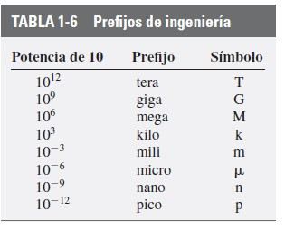
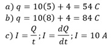
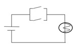

# Informe Tarea N°1
**Integrantes:**

Christian Bonifaz, Mateo Calderon, Josue Camacho, Luis Guevara

**NRC:** 5415

**Docente:** Ing. Darwin Alulema

**Tema:** Capitulo 1 (Introducción) y capitulo 2 (Voltaje y corriente) de Análisis de Circuitos - Robbins, Miller

### 1. OBJETIVOS

- Conocer y analizar las ideas y conceptos básicos sobre los circuitos y sus componentes, así como también sobre el voltaje y la corriente que fluye dentro del mismo, y entendiendo la corriente como un movimiento de carga.

- Comprender y conocer cómo se generan las fuentes de voltaje comunes y también como medirlas con su instrumento y su conexión adecuada.

- Desarrollar por medio de ejercicios propuestos los conocimientos adquiridos en los capítulos previamente estudiados sobre el voltaje y corriente y su introducción al análisis de circuitos.

### 2. MARCO TEÓRICO

**CAPITULO 1 (Introducción)**

**CAPITULO 2 (Voltaje y corriente)**

### 3. EXPLICACIÓN Y RESOLUCIÓN DE EJERCICIOS O PROBLEMAS
**CAPITULO 1 (Introducción)**

**1) Realice las siguientes conversiones:**

**a) 27 minutos a segundos**

1 min = 60 s

27 min * 60s = 1620s

**b) 0.8 horas a segundos**

1 h = 3600s

0.8h * 3600s = 2880s

**c) 2 h 3 min 47 s a s**

2h * 3600s = 7200s

3 min * 60s = 180s

7200s + 180s + 47s = 7427s

**d) 35 caballos de potencia a watts**

35 c.potencia * 735 = 25725 watts

**e) 1827 W a hp**

1827 W / 746 = 2.45 hp

**f) 23 revoluciones a grados**

1 rev = 360 grados

23 rev * 360 grados = 8280 grados

**2) Realice las siguientes conversiones:**

**a) 27 pies a metros**

1 pie = 0,3048 m

27 pies * 0,3048 = 8,229 m

**b) 2.3 yd a cm**

1 yd = 91.44 cm

2.3 yd * 91.44 cm = 210.312 cm

**c) 36°F a °C**

(n°F - 32) * 5/9 = °C

(36°F - 32) * 5/9 = 2.222 °C

**d)18 galones(E.U) a litros**

1 galón = 3.78541 litros

18 galones * 3.785441 litros = 68.138 litros

**e) 100 pies cuadrados a m^2**

1 pie cuadrado = 0.092903 m^2

100 pies cuadrados * 0.092903m^2  = 9.2903 m^2

**f) 124 pulgadas cuadradas a m^2**

1 pulgada cuadrada = 0,00064516 m^2

124 pulgadas cuadradas * 0,00064516 m^2= 0.08m^2

**g) 47 libras fuerza a newtons**

1 lbf = 4,44822 N

47 lbf * 4,44822 N = 209.066 N

**3) Establezca los factores de conversión, calcule lo siguiente y exprese la respuesta en las unidades que se indican.**

**a) El área de una placa de 1.2 m por 70 cm en m^2.**

70 cm =70*0.01=0.7m

Area placa=Lado * Lado

1.2* 0.7= 0.84m^2

**b) El área de un triángulo con 25 cm de base, altura 0.5 m en m^2.**

25 cm = 25 * 0.01=0.25 m

área triángulo = (b* h)/2

(0.25* 0.5)/2=0.0625 m^2

**c) El volumen de una caja de 10 cm por 25 cm por 80 cm en m^3.**

10 cm= 10*0.01=0.1 m

25 cm= 25* 0.01=0.25 m

80cm= 80*0.01=0.8 m

V = 0.1x 0.25 * 0.8

V=0.02 m^3

**d) El volumen de una esfera de 10 pulgadas de radio en m^3.**

10 in *2.54cm=25.4 cm

25.4 cm * 0.01m= 0.254 m

V=4/3r3

V=4/3(0.254)^3

V=0.06864 m^3

**4) Un ventilador eléctrico gira a 300 revoluciones por minuto. ¿A cuánto equivale en grados por segundo?**

1 rpm = 6 grados por s

300 rpm * 6 grados por s = 1800 grados por s

**5) Si la máquina robot de montaje superficial de la figura 1-3 coloca 15 partes cada 12 s, ¿cuál es su tasa de colocación por hora?**

15* 5= 75 piezas por segundo

12 * 5=60s

75* 60=4500 piezas por hora

**6) Si su impresora láser puede imprimir 8 paginas por minuto, ¿cuántas páginas puede imprimir en una décima de hora?**

 8 páginas = 1 min
 
1 decima=60min / 10(décimas)= 6 min

 8 páginas = 1 min
 
   x   =  6 min 

x=8* 6=48 hojas

**7) Un auto tiene un rendimiento de 27 millas por galón (E. U.). ¿Cuál es el rendimiento en kilómetros por litro?**

1 milla por galón = 0,425144 km/litro

27 millas por galón * 0,425144 km/litro = 11.479 km/litro

**8) El radio ecuatorial de la Tierra es de 3963 millas. ¿Cuál es la circunferencia de la Tierra en kilómetros en el Ecuador?**

1 milla = 1,60934 km

3963 millas * 1.60934 km = 6377.815 km

**9) Una rueda gira 18° en 0.02 s. ¿A cuántas revoluciones por minuto equivale esta cantidad?**

1/0.02 = 50 veces en un segundo

18 * 50 = 900 grados por segundo

900 * 60 min = 54000 grados por minuto

54000/360 = 150 revoluciones por minuto

150 revoluciones por minuto

**10) La altura de los caballos se mide en ocasiones en “palmos” donde 1 palmo = 4 pulgadas. ¿Cuántos metros de altura mide un caballo de 16 palmos?, ¿y en centímetros?**

1 palmo = 4 pulgadas 

16 palmos * 4 pulgadas = 64 pulgadas

1 pulgada = 2.54 cm

64 pulgadas* 2.54 cm = 162.56 cm

**11) Se define la ecuación s=vt, donde s es la distancia recorrida, v es la velocidad y t es el tiempo. Si usted viaja a v= 60 mph por 500 segundos, obtiene y sustituye sin pensar s=  (60)(500) =30 000 millas. ¿Cuál es el error en este cálculo? ¿Cuál es la respuesta correcta?**

500s=500/3600=0.13889h

s=vt

s=60 milla/h * 0.13889h

s=8.3333 millas

El error que se comete en este cálculo es que el tiempo se encuentra en segundos y para realizar lo debería estar en horas.

*La respuesta es : s=8.3333 millas.* 

**12) Una pizza redonda tiene una circunferencia de 47 pulgadas. ¿Cuánto tiempo tardará en cortarla diagonalmente con un cortador de pizza que viaja a 0.12 m/s?**

47 in = 47/39.37= 1.19380m

t=1.19380/0.12

t=9.9484s

**13) A Joe S. se le pidió convertir 2000 yd/h en metros por segundo. Aquí está el trabajo de Joe: velocidad 2000 x 0.9144 x 60/60=1828.8 m/s. Determine los factores de conversión, escriba las unidades en la conversión y determine la respuesta correcta.**

1 yd/h = 0,000254 m/s

2000 yd/h * 0,000254 m/s = 0.508 m/s

**14) La distancia media de la Tierra a la Luna es 238 857 millas, Las señales de radio viajan a 299 792 458 m/s. ¿Cuánto tiempo tardan las señales de radio en llegar a la Luna?**

238857 millas= 238857* 1609=384320913 metros

R=d/t

299 792 458 m/s=384320913 m /t

t=1.281957s

**15) Si camina a una velocidad de 3 km/h por 8 minutos, 5 km/h por 1.25 h y luego continúa caminando a una velocidad de 4 km/h por 12 minutos, ¿qué distancia habrá caminado en total?**

8 min = 8/60 = 0.13h

12 min = 12/60 = 0.2h

0.13h x 3 km/h = 0.39km

0.2h x 4 km/h = 0.8km

1.25h x 5 km/h = 6.25 km

Distancia total = 0.39 + 0.8 + 6.25 = 7.44 km

**16) Suponga que camina a una velocidad de 2 mph por 12 minutos, 4 mph por 0.75 h, luego termina de caminar a 5 mph por 15 minutos, ¿qué distancia habrá caminado en total?**

12 min=12/60=0.2 h

15 min= 15/60 = 0.25h

0.2h * 2mi/h=0.4 mi

0.75h* 4 mi/h= 3 mi

0.25h* 5mi/h=1.25 mi

Distancia total = 0.4+3+1.25=4.65 mi

**17) Usted camina por 15 minutos a una velocidad de 2 km/h, luego 18 minutos a 5 km/h, y el resto del tiempo su velocidad es de 2.5 km/h. Si la distancia total que recorrió es de 2.85 km, ¿cuántos minutos caminó a 2.5 km/h?**

15 min= 15/60=0.25h 

18 min=18/60=0.3h

2.85=(0.25)(2)+(0.3)(5)+(2.5)t3

2.85=0.5+1.5+2.5t3

2.5t3=2.85-2

2.5km/h *t3=0.85km

t3=0.34h

**18) Usted camina por 16 minutos a una velocidad de 1.5 mph, acelera a 3.5 mph por un corto tiempo y disminuye a 3 mph para los últimos 12 minutos. Si la distancia total recorrida es de 1.7 millas, ¿cuánto tiempo caminó a 3.5 mph?**

16 min=16/60=4/15h

12min=12/60=0.2h

1.5=(4/15)(1.5)+(0.2)(3)+(3.5)t2

1.5=0.4+0.6+3.5t2

3.5 mi/h* t2=0.5 mi

t2=1/7 h

t2=0.14286 h

**19) Su jefe de planta le pide investigar dos máquinas. El costo de electricidad para la operación de la máquina # 1 es 43 centavos/minuto, mientras que para la máquina # 2 es de $200.00 por turno de 8 horas. El precio de compra, la capacidad de producción, los costos de mantenimiento y la confiabilidad a largo plazo de ambas máquinas son idénticos. Con base en esta información, ¿qué máquina debería comprar y por qué?**

Máquina # 1

43 ctvs * minuto

1440 min = 1 día

43* 1440 = 61920 ctvs

61920/100 = 619.2 dólares por dia

Máquina # 2

200 por turno

3 turnos = 24 horas

200* 3=600 dolares por dia

La opción 2 conviene puesto que cuesta menos y puede generar mayor ganancia.

**20) Dado que 1 hp=550 ft-lb/s, 1 ft=0.3048 m, 1 lb=4.448 N, 1 J=1 N-m y 1 W=1 J/s, demuestre que 1 hp=746 W**.

**21) Exprese cada unas de las siguientes cantidades en notación de potencias de diez con un dígito diferente de cero a la izquierda del punto decimal:**

**a) 8675**

8.675 * 10^3

**b) 0.00872**

 8.72 * 10^-3

**c) 12.4 x 10^2**

1.24 * 10^3

**d) 37.2 x 10^-2**

3.72 * 10^-1

**e) 0.00348 x 10^5**

3.48 * 10^2

**f)0.000215 x 10^-3**

2.15 * 10^-7

**g)14.7 x 10^0**

1.47 * 10^1

**22)  Exprese las respuestas de cada unas de las siguientes cantidades en notación de potencias de diez con un dígito diferente de cero a la izquierda del punto decimal:**

**a) (17.6)(100)**

1760

1.76 * 10^3

**b) (1400)(27 x 10^-3)**

37.8

3.78 * 10^1

**c) (0.15 x 10^6)(14 x 10^-4)**

210

2.1 * 10^2

**d) 1 x 10^-7x 10^-4 x 10.65**

1.065 * 10^-10

**e) (12.5)(1000)(0.01)**

125

1.25 * 10^2

**f) (18.5x 10^0)(100)(1.5x10^-5)(0.001)**

2.775 * 10^-5

**23) Repita las instrucciones de la pregunta 22 para las siguientes cantidades.**

**a)125/1000**

1.25 * 10^-1

**b)(8 * 10^4)/(0.001)**
 80 000000 
8 * 10^7

**c)(3 * 10^4)/(1.5 * 10^6)**

3/15 * 10^4/10^6

2 * 10^-2

**d)[(16 * 10^-7)(21.8 * 10^6)]/[(14.2)(12 * 10^-5)]**

43 60000/213

2.04694835680751 * 10^4

**24) Determine el resultado de las siguientes operaciones**

**a) 123.7+0.05+1259x10^-3** 

125.009

**b) 72.3x10^-2+1x10^-3**

0.724

**c) 86.95x10^2-383**

8309

**d)452x10^-2+(697)(0.01)**

11.49

**25) Convierta las siguientes cantidades a notación de potencias de 10, y sin usar la calculadora determine las respuestas.**

**a)(4x10^3)(0.05)^2**

(4 * 10^3)(0.0025)

(4 * 10^3)(2.5 * 10^3)

(4 * 2.5)(10^3 * 10^3)

10 * 10^6

**b)(4x10^3)(-0.05)^2**

(4 * 10^3)(0.0025)

(4 * 10^3)(2.5 * 10^3)

(4 * 2.5)(10^3x10^3)

10 * 10^6

**c)[(3 x 2 * 10) ^2] / [(2 x5 x 10^-1)]**

**d)[( 30+20)^-2(2 x 10^6 )(6000)]/[(1 x 10^3)(2 x 10^-1)^2]**

**e) [(-0.027)^1/3 (-0.2)^2]/[(23+1)^0 x 10^-3]**

**26) Para cada una de las siguientes cantidades convierta los números a notación de potencias de diez, después realice los cálculos que se indican. Redondee su respuesta a cuatro dígitos:**

**a)(452)(6.73x10^4)**

(4.52 x 10^2)(6.73 x 10^4)

3.04196 x 10^7

3.042 x 10^7

**b)(0.00985)(4700)**

(9.85x10^-3)(4.7x10^3)

4.629x10^1

**c)(0.0892)/(0.0000673)**

**d)12.40-236 x 10^-2**
10.04

1.004x10^1

**e)(1.27)^3+47.9/(0.8)^2**

76.892133

7.6892133x10^1

7.6892x10^1

**f)(-643x10^-3)^3**

-0.265847707

-2.6585x10^-1

**g)[ (0. 0025) ^1/2] * [1.6x10^4]]**

(5x10^-2)x(1.6x10^4)

8x10^2

**h)[(-0.027)^1/3]/[1.5x10^-4]**

**i)[(3.5 x 10^4)^-2 (0.0045)^2(729)^1/3]/([(0.00872 * (47)^3)]-356)**

**27) Realice lo siguiente**

**a) Convierta los números a notación de potencias de diez, después realice los cálculos que se indican.**

i) 111788 x10^-4

ii) 4450 x10^-3

**b)Realice la operación directamente en la calculadora sin conversión. ¿Cuál es su conclusión?**

**i)842 x 0.0014**
1.1788 

No es necesario cambiar la cantidad a notación científica puesto que no existe un infinito de decimales como en otros ejemplos.

**ii)(0.0352)/(0.00791)**

4.450  

Sería necesario usar la notación científica para no tener tantos decimales y con ello ser más exactos en algún cálculo

**28) Exprese cada una de las siguientes cantidades en notación convencional:**

**a)34.9 x 10^4**

349000

**b)15.1 x 10^0**

15.1

**c)234.6 x 10^-4**

0.02346

**d)6.97 x 10^-2**

0.0697

**e)45786.97 x 10^-1**

4578.697

**f)6.97 x 10^-5**

0.0000697

**29) Un coulomb (capítulo 2) es la cantidad de carga representada por 6 240 000 000 000 000 000 electrones. Exprese esta cantidad en notación de potencias de diez.**

6.24x 10^16 electrones

**30) La masa de un electrón es 0.000 000 000 000 000 000 000 000 000 000 899 9 kg. Exprese esta cifra como una potencia de 10 con un dígito diferente de cero a la izquierda del punto decimal.**

8.999 x10^-31 kg

**31) Si 6.24 x 10^18 electrones pasan a través de un alambre en 1 s, ¿cuántos pasan a través de él durante un intervalo de 2 hr, 47 min y 10 s?**

2 hr=2x3600=7200s

47 min=47x60=2820s

t2=7200+2820+10

t2=1.003x10^4s

**6.24 x 10^18 electrones = 1 s**

**x electrones =1.003x10^4s**

x electrones= 6.24 x 10^18x1.003x10^4

x electrones= 6.25872x10^22

En el intervalo de tiempo de  2 hr, 47 min y 10 s pasarían 6.25872x10^22 electrones.

**32)Calcula la distancia en metros que viaja la luz en el vacío en 1.2 x 10^-8 segundos.**

velocidad es constante

V=3x10^5 km/s

t = 1.2 x 10^-8 s

x= distancia 

**x=Vxt**

x=6x10^5 km/s x 1.2x10^-8 s

x= 3.6x10^-3 km

**33)¿Cuánto tiempo tarda la luz en viajar 3.47 x 10^5 km en el vacío?**

**34)¿Qué tan lejos viaja la luz en km en un año luz?**

Un año luz equivale aproximadamente a 9 billones de kilómetros.

Un año luz = 9x10^12 km

**35) Al investigar un sitio para un proyecto hidroeléctrico se determina que el flujo de agua es de 3.73 x 10^4 m^3/s. ¿A cuánto equivale esta cantidad en litros/hora?**

**36) La fuerza gravitacional entre dos cuerpos es F = 6.6726x10^11 (m1m2/r^2)N,donde las masas m1 y m2 están en kilogramos y la distancia r entre los centros gravitacionales está en metros. Si el cuerpo 1 es una esfera con radio de 5000 millas y densidad de 25 kg/m^3, y el cuerpo 2 es una esfera de diámetro de 20 000 km y densidad de 12 kg/m^3. ¿Cuál es la fuerza gravitacional entre ellos?**

**37) ¿Cuál es el prefijo apropiado y su abreviatura para cada uno de los siguientes multiplicadores?**

**a)1000**

1x10^3 Kilo

**b)1000000**

1x10^6 Mega

**c)10^9**

100 000 0000 Giga

**d)0.000001**

1x 10^-6 micro

**e)10^-3**

0.001 mili

**f)10^-12**

 0.000000000001 pico
 
 **38) Exprese lo siguiente en términos de sus abreviaturas, es decir, microwatts como uW. Ponga atención en las mayúsculas (esto es, V no v, para volts).**
 
 **a) miliamperes**
 
 mA
 
 **b) kilovolts**
 
 kV
 
 **c) megawatts**
 
 MW
 
 **d) microsegundos**
 
 µs
 
 **e) micrómetros**
 
 µm
 
 **f) milisegundos**
 
 ms
 
 **g) nanoamperes**
 
 nA
 
 **39)Exprese lo siguiente en la notación de ingeniería más práctica (esto es, 1270 µs=1.27 ms).**

**a) 0.0015 s**

1.5 ms

**b) 0.000027s**

27 µs

**c) 0.00035 ms**
 
 0.35 µs
 
 **40) Convierta lo siguiente:**
 
 **a) 156 mV en volts**
 
 1mV = 0.001 V
 
156x0.001= 0.156 V

**b) 0.15mV a microvolts**

1mV = 1000µV

0.15x1000 = 150 µV 

 **c) 47 kW a watts**
 
 1kW = 1000 watts
 
47 x 1000 = 47000 watts

 **d) 0.057 MW a kilowatts**
 
 1MW = 1000 kilowatts
 
0.057 x 1000 = 57 kilowatts

 **e) 3.5 x 104 volts a kilowatts**
 
 1 volt = 0.001 kilowatts
 
34000 x 0.001 = 34 kilowatts

 **f) 0.0000357 amperes a microamperes**
 
 1 amperio = 10 00000 microamperes
 
0.0000357 x 10 00000 = 35.7 microamperes

 **41)Determine los valores que se deben insertar en el espacio en blanco.**
 
**a) 150 kV=..... x 10^3 V = ….. x 10^5 V**

150 kV= 1 x 10^3 V = 1.5 x 10^5 V

**b) 330 uW=..... x 10^-6 W= …. x 10^-4 W**

330 uW=1x 10^-6 W=2.5 x 10^-4 W

**42) Realice las operaciones y exprese las respuestas en las unidades que se indican.**

**a) 700 uA - 0.4 mA        =....uA   ;  =....mA**

700 uA - 400 uA

300 uA

0.7 mA - 0.4 mA

0.3 mA

**b) 600 MW + 300 x 10^4 W     =.... MW**

600 MW + 3 MW

603 MW

**43) Realice las operaciones y exprese las respuestas en las unidades que se indican.**

**a) 330 V+0.15 kV + 0.2 X 10^3 V   =.....V**

330 V + 150 V + 200 V

680 V

**b) 60 W +100 W + 2700 mW   =......W**

60 W + 100 W + 2.7 W 

162.7 W

**44) El voltaje de una línea de transmisión de alto voltaje es de 1.15 x 10^5 V.¿Cuál es el voltaje en kV?**

1 V = 0.001 kV

115000 x 0.001

115 kV

**45) Se compra un radiador eléctrico de 1500 W para calentar una habitación.¿Cuántos kW es esta cantidad?**

1 W = 0.001 kW

1500 x 0.001

1.5 kW

**46) Considere la figura 1-11. Como aprenderá en el capítulo 6, I4 = I1 + I2 + I3. Si I1=1.25 mA, I2=350 A e I3 =250 x 10^5 A, ¿cuánto vale I4?**

I1=0,00125 A

I4 = I1 + I2 + I3

I4= 0,00125 A + 350 A + 25 000000 A

I4 = 25 000350 A

**47)Para la figura 1-12, I1 +I2 -I3+ I4=0. Si I1 =12 A, I2 =0.150 kA e I4 =250 x 10^-1 A, ¿cuánto vale I3?**

I2 = 1.5 x 10^5 A

I1 +I2 -I3+ I4=0

I3 = I1 +I2+ I4

I3 = 12 A + 150000 A + 25 A

I3 = 150037 A

**48) En cierto circuito electrónico, V1 =V2 - V3 -V4. Si V1= 120 mV, V2=5000 uV y V3=20 x  10^-4 V, ¿cuánto vale V4?**

V1= 120 mV

V1= 120000 uV

V3= 20 x  10^-4 V

V3= 2000 uV

V1 =V2 - V3 - V4

V4 = -V1+V2 - V3

V4 = -120000 uV + 5000 uV - 2000 uV

V4 = -117000 uV

V4 = -1.17 x 10^5 uV

**49) Al reparar un radio antiguo se encuentra un capacitor defectuoso designado por 39 mmfd. Después de investigar se encuentra que “mmfd” es una unidad obsoleta que significa “micromicrofarads”. Se requiere un capacitor de reemplazo de valor equivalente. Consulte la tabla 1-6, ¿cuál será el valor equivalente a 39 “micromicrofarads”?**

(39x10^-6)x10^-6

3.9x10^-11 µµF

**50) a) Si 0.045 coulomb de carga (pregunta 29) pasan a través de un alambre en 15 ms, ¿a cuántos electrones equivale esto?**

**b) Con una rapidez de 9.36 x 10^-19 electrones por segundo, ¿cuántos coulombs pasan por un punto de un alambre en 20 us?**

**51) Una señal de radio viaja a 299 792.458 km/s y una señal telefónica a 150 m/s. Si ambas se originan en el mismo punto, ¿cuál llega primero a un destino alejado 5000 km? ¿Cuánto tiempo pasa entre la llegada de una y otra?**

**52) En el capítulo 4 aprenderá que la potencia de cd está dada por el producto del voltaje y la corriente, esto es, P=V x  I watts.**

**a) Si V = 50 V e I=24 mA(ambos valores exactos),¿cuánto vale P en watts?**

I=24mA=24/1000=2.4x10^-2 A

**P=V x I**

P=50x2.4x10^-2 

P=1.2 watts

**b) Si el voltaje se mide con un voltímetro como V= 50.0+- 0.1 volts y la corriente se mide con un amperímetro como I=24.0+- 0.1 mA,¿qué concluye acerca de P con base en los valores medidos?**

Se puede concluir que existe un porcentaje de error de +-  0.1 volts y de +-1x10^-4  A a lo cual para calcular se haría de la siguiente manera:

I=24mA=24/1000=2.4x10^-2 +-1x10^-4A

**P1=VxI**

P1=(50+0.1)x(2.4x10^-2+1x10^-4)

P1=1.2025 watts

**P2=VxI**

P2=(50-0.1)x(2.4x10^-2+1x10^-4)

P2=1.1977  watts

**P3=VxI**

P3=(50-0.1)x(2.4x10^-2-1x10^-4)

P3=1.1975  watts

**P4=VxI**

P4=(50+0.1)x(2.4x10^-2-1x10^-4)

P4=1.2023 watts

**53) En el capítulo 4 aprenderá que la resistencia está dada por la razón entre el voltaje y la corriente, es decir, R=V/ I ohms.**

**a) Si V=50 V e I=24 mA (ambos valores exactos),¿cuánto vale R?**

**b) Si el voltaje se mide como V = 50.0+- 0.1 volts y la corriente como I=24.0 +- 0.1 mA,¿qué concluye acerca de R con base en los valores medidos?**
Se puede concluir que existe un porcentaje de error de +-  0.1 volts y de +-1x10^-4  A a lo cual para calcular se haría de la siguiente manera:

**54) El componente soldado en el circuito impreso de la Figura 1-13(a) es un dispositivo electrónico conocido como circuito integrado. Como está indicado en (b), el espaciamiento de centro a centro entre sus terminales es de 0.8+-0.1 mm. Los diámetros de las terminales pueden variar de 0.25 mm a 0.45 mm.Considere estas incertidumbres y calcule la distancia mínima y máxima entre las terminales debida a las tolerancias de fabricación.**

**55) Considere el diagrama pictográfico de la figura 1-14. Use los símbolos apropiados de la tabla 1-7 para dibujar un diagrama esquemático. Sugerencia: en los siguientes capítulos hay muchos circuitos esquemáticos que contienen resistores, inductores y capacitores. Utilícelos como ayuda.**

Gráfico esquemático a mano

Gráfico esquemático a computadora

**56) Elabore el diagrama esquemático para una simple linterna.**

Gráfico esquemático a mano

Gráfico esquemático a computadora

**57) Muchas revistas de electrónica y computación contienen anuncios de herramientas de software para computadora como el Pspice, Mathcad, Matlab y muchos otros. Consulte algunas de estas revistas en la biblioteca de su escuela. Al estudiar estos anuncios se logra obtener un conocimiento valioso acerca de lo que los paquetes de software modernos son capaces de hacer.**

Existen múltiples programas para diseñar y experimentar circuitos electrónicos, algunos gratuitos, otros online y otros de pago.Diseñar y experimentar circuitos de manera física es un trabajo arduo y dificultoso pero con la ayuda de estos programas vamos a ser capaces de experimentar primero nuestros diseños antes de implementarlos para poder asegurarnos de que todo funciona como queremos evitando así cualquier tipo de fallo y sobre todo costos.

En el mercado actual existe una gran variedad de programas que podemos usar como simuladores de paga y gratuitos:

Simuladores gratuitos

- KiCad

Es una herramienta gratuita multiplataforma para la creación de diagramas electrónicos y diseños de PCB. Dispone de un gestor de proyectos, un editor de esquemas y componentes, selector de huellas, editor de placas de circuito, visor de archivos Gerber, creación de componentes o huellas a partir de imágenes bitmap, calculadora PCB y un editor de formatos de página.

- ProfiCAD

Es una herramienta gratuita multiplataforma para dibujar diagramas eléctricos y circuitos de control aunque también se puede utilizar para diagramas hidráulicos, neumáticos y otros tipos de diagramas técnicos. Su interfaz es muy sencilla e incluye muchísimos símbolos aunque permite también crear diseños propios (funcionalidad de pago). Admite la numeración automática de símbolos, listas de cables, de materiales y otras funcionalidades avanzadas.

- TinyCAD

Dispone de varias bibliotecas de símbolos y también permite crear listas de redes que pueden posteriormente utilizarse en programas de diseño de circuitos impresos como FreePCB.

- Tinkerkad 

Es una colección gratuita en línea de herramientas de software que ayudan a personas de todo el mundo a pensar, crear y hacer. Somos la introducción ideal a Autodesk , el líder en software de entretenimiento, ingeniería y diseño 3D.

Simuladores de costo

- Fritzing

Hace accesible a todo el mundo la electrónica como material creativo para todos, puesto que dispone de una comunidad en la que se fomenta un ecosistema de creatividad.

- AutoCAD Electrical 2020

Está considerado como el mejor software para diseño de circuitos y es el mejor para todos los ingenieros electrónicos que buscan realizar sus diseños arquitectónicos.

- SOLIDWORKS Electrical 2020

Es muy bueno para colaboración, ya que dispone de herramientas integradas para facilitar. Es perfecto para el desarrollo de diseños complejos en poco tiempo y de gran calidad.

Existe una gran variedad de programas sea para la pc o tener online que se puede usar para circuitos eléctricos, lo cual es muy beneficioso para los estudiantes que estamos aprendiendo.

**Información obtenida:** 
Velasco, R. (07 de Abril de 2021). Softzone. Obtenido de Softzone: https://www.softzone.es/programas/utilidades/simuladores-circuitos-electronicos/

**CAPITULO 2 (Voltaje y corriente)**

**1. ¿Cuántos electrones libres a temperatura ambiente hay en los siguientes elementos?**

a. 1 metro cúbico de cobre =10^29

b. Un alambre de cobre de 5 metros de longitud cuyo diámetro es 0.163 cm =10,4*10^23

**3. Dos cargas están separadas por cierta distancia. Si la magnitud de una carga se duplica y la otra se triplica y la distancia entre ellas se reduce a la mitad, ¿cómo se ve afectada la fuerza?**

Se incrementa por un factor de 24.

**4. Cierto material tiene 4 electrones en su capa de valencia y un segundo material tiene 1. ¿Cuál es mejor conductor?**

El que tiene 4 electrones, Entre mayor sean los electrones de valencia mayor conductividad tiene el material

**5. a. ¿Qué hace que un material sea buen conductor? (En su respuesta considérelas capas de valencia y los electrones libres.)**

Material con muchos electrones libres (es decir, material con 1 electrón en la capa de valencia).

b. Además de ser un buen conductor, mencione otras dos razones por las que el cobre es ampliamente usado.

No es costoso y forma alambres con facilidad.

c. ¿Qué hace que un material sea buen aislante?

La capa de valencia está llena, por tanto, no hay electrones libres.

d. Normalmente el aire es un aislante; sin embargo, durante las descargas de rayos hay conducción. Discuta brevemente el mecanismo de flujo de carga en esta descarga.

La gran fuerza eléctrica arranca los electrones de la órbita.

**6. a. Aunque el oro es muy caro, en ocasiones se usa en electrónica como recubrimiento en contactos. ¿Por qué?**

Porque es mucho mejor conductor que otros materiales como el cobre, y por ende permiten mejor la transmisión de información.

b. ¿Por qué algunas veces se usa el aluminio cuando su conductividad es sólo 60% de la del cobre?

Porque el aluminio es mucho más fácil de manejar y es mas ligero que el cobre.

**7.Calcule la fuerza eléctrica entre las siguientes cargas y establezca cuándo es de atracción y cuándo de repulsión.**

a. Una carga de +1µC y una carga de +7µC, separadas 10 mm

b. Q1=8µC y Q2=-4µC, separados por 12cm

c. Dos electrones separados 12* 10^(-8) m

d. Un electrón y un protón separados 5.3* 10^(-11) m

e. Un electrón y un neutrón separados 5.7* 10^(-11) m

El neutrón no posee carga, por lo tanto, F= 0 

**8. ¿Qué significado tiene decir que un cuerpo está “cargado”?**

Significa que un cuerpo ha perdido o ganado electrones, En el caso de que un cuerpo tenga más electrones que protones se dice que está cargado negativamente, y en el caso contrario el cuerpo de encuentra cargado positivamente.

**9. La fuerza entre dos cargas, una positiva y una negativa, separadas 2 cm es de 180N. Si Q1=4µC. ¿Cuánto vale Q2? ¿la fuerza es de atracción o de repulsión?**

**10. Si se pudiera colocar una carga de 1 C en cada uno de dos cuerpos que están separados 25 cm de centro a centro, ¿cuál sería la fuerza entre ellas en newtons?,¿y en toneladas?**

**11. La fuerza de repulsión entre dos cargas separadas 50 cm es de 0.02 N. Si Q_2=5Q_1, determine las cargas y su posible signo.**

**12. ¿Cuántos electrones representa una carga de 1,63µC?**

**13. Determina la carga en 19 * 10^13 electrones**

**14. Una placa de metal eléctricamente neutra adquiere una carga negativa de 47µC. ¿Cuántos electrones se le agregaron?**

**15. A una placa de metal se le han adicionado 14,6 * 10^13 electrones y posteriormente se le agrega una carga de 1,3 µC. Si la carga final en la placa es de 5,6µC, ¿cuál fue la carga inicial?**

**16. Al deslizar una silla y tocar algún objeto puede provocar un choque eléctrico. Explique por qué.**

Porque al realizar eso hacemos fricción y mediante aquello generamos corriente electroestática

**17. Si se requieren 360 Joules de energía para transferir 15 C de carga a través de la lámpara de la figura 2-1, ¿cuál es el voltaje de la batería?**

**18. Si se requiere de 600 J de energía para mover 9.36 * 10^19 electrones de un punto a otro, ¿cuál es la diferencia de potencial entre los dos puntos?**

**19. Si se requiere de 1.2 kJ de energía para mover 500 mC de un punto a otro, ¿cuál es el voltaje entre los dos puntos?**

**20. ¿Cuánta energía se requiere para mover 20 mC de carga a través de la lámpara de la figura 2-23?**

W=(20 * 10^(-3) C)(47,2V)=0,944J

**21. ¿Cuánta energía adquiere una carga de 0,5µC conforme se mueve a través deuna diferencia de potencial de 8.5 kV?**

W=(0,5 * 10^(-6) C)(8,5 * 10^3 V)=4,25mJ

**22. Si el voltaje entre dos puntos es de 100 V, ¿cuánta energía se requiere para mover un electrón entre los dos puntos?**

W=(1,6 * 10^(-19) C)(100V)=1,6*10^(-17) J

**23. Dado un voltaje de 12 V para la batería de la figura 2-1, ¿cuánta carga se mueve a través de la lámpara si se requieren 57 J de energía para moverla?**

**24. Para el circuito de la figura 2-1, si 27 C pasan a través de la lámpara en 9 segundos, ¿cuál es la corriente en amperes?**

**25. Si 250 uC pasan a través del amperímetro de la figura 2-32 en 5 ms, ¿cuál será la lectura del medidor?**

**26. Si la corriente I=4 A en la figura 2-1, ¿cuántos coulombs pasan a través de la lámpara en 7 ms?**

**27. ¿Cuánta carga pasa a través del circuito de la figura 2-25 en 20 ms?**

**28. ¿Cuánto tiempo le toma a una carga de 100 uC pasar por un punto si la corriente es de 25 mA?**

**29. Si 93.6 x 1012 electrones pasan a través de una lámpara en 5 ms, ¿cuál es la corriente?**

**30. La carga que pasa a través de un alambre está dada por q=10t+4, donde q está en coulombs y t en segundos, a. ¿Cuánta carga ha pasado en t=5 s? b. ¿Cuánta carga ha pasado en t=8 s? c. ¿Cuál es la corriente en amperes?**

**31. La carga que pasa a través de un alambre es q=(80t+20) C. ¿Cuál es la corriente? Sugerencia: seleccione dos valores arbitrarios de tiempo y proceda como en la pregunta 30.**

**32. ¿Cuánto tiempo le toma a 312x1019 electrones pasar a través del circuito de la figura 2-32 si la lectura del amperímetro es de 8 A?**

**33. Si se requieren 1 353.6 J para mover 47x1019 electrones a través de la lámpara de la figura 2-32 en 1.3 min, ¿cuánto valen E e I?**

**34. ¿Qué se entiende por cd?, ¿y por ca?**

Cd es aquella corriente que solo tiene una dirección.
Ca es aquella corriente que cambia su dirección y su valor periódicamente.

**35. Considere tres baterías conectadas como en la figura 2-33. a. Si E1=1.47 V, E2=1.61 V y E3=1.58 V, ¿cuánto vale ET? b. Si se invierte la conexión a la fuente 3, ¿cuánto vale ET?**

**36. ¿Cómo se carga una batería secundaria? Haga un bosquejo. ¿Se puede cargar una batería primaria?**

Podemos recargar una batería secundaria conectándola a una fuente de voltaje de CD que tenga un voltaje terminal mayor o igual al voltaje terminal deseado de la batería secundaria.

**37. Una batería especificada en 1 400 mAh suministra 28 mA a una carga. ¿Cuánto tiempo se espera que dure?**

**38. ¿Cuál es la vida de servicio aproximada de la celda D de la tabla 2-1 con un consumo de corriente de 10 mA, de 50 mA y de 100 mA? ¿Qué concluye de estos resultados?**

Con 10mA su duración es de 525h, con 50mA su duración es de 125h y con 100mA su duración es de 57h.

**39. La batería de la figura 2-15 está especificada en 81 Ah a 5°C. ¿Cuál es el tiempo de vida esperado (en horas) con un consumo de corriente de 5 A a -15°C?**

**40. Se espera que la batería de la figura 2-15 dure 17 h con un consumo de corriente de 1.5 A a 25°C. ¿Cuánto tiempo espera que dure a 5°C con un consumo de corriente de 0.8 A?**

**41. En el trabajo de ingeniería en ocasiones se tienen que hacer estimaciones basadas en la información que se tiene disponible. En este tenor, suponga que tiene un dispositivo operado con batería que usa la celda C de la tabla 2-1. Si el dispositivo requiere 10 mA, ¿cuál es el tiempo estimado (en horas) que será capaz de usar?**

**42. El voltímetro digital de la figura 2-34 tiene la característica de autopolaridad. Para cada caso, determine su lectura.**

a) 25V
b) 25V
c) 14V
d) -6V

**43. La corriente en el circuito de la figura 2-35 es 9.17 mA. ¿Cuál amperímetro indica correctamente la corriente? (a) El medidor 1, (b) el medidor 2, (c) ambos.**

La respuesta correcta es c ambos.

**44. ¿Cuál es el error en la afirmación de que el voltaje a través de la lámpara de la figura 2-24 es 70.3 V?**

La afirmación de que el voltaje a través de la lámpara es de 70,3 V es incorrecta porque el voltaje no atraviesa nada; el voltaje es una diferencia de potencial y aparece a través de las cosas. Es por eso que conectamos un voltímetro a través de los componentes para medir su voltaje

**45. ¿Cuál es el error con el esquema de medición que se muestra en la figura 2-36? Corríjalo.**

El error es que el voltímetro está conectado en seria cuando debería estar en paralelo, y el amperímetro está conectado en paralelo cuando debería estar en serie.

**46. Se Desea controlar la luz de una lámpara mediante dos interruptores, como se indica en la tabla 2-2. Dibuje el circuito requerido.**

**47. Los fusibles tienen una especificación de corriente de manera que se puede seleccionar el tamaño adecuado para proteger un circuito contra un exceso de corriente. También tienen una especificación de voltaje. ¿Por qué? Sugerencia: lea la sección de aislantes, sección 2-1.**

Los fusibles tienen una clasificación de corriente para que podamos seleccionar el tamaño adecuado para proteger un circuito contra sobrecorriente. también tienen una clasificación de voltaje porque el aislador del fusible está diseñado para soportar el voltaje deseado. si el voltaje a través del fusible excede este voltaje deseado, el aislante se dañará.

### 4. VIDEO
### 5. CONCLUSIONES 
### 6. BIBLIOGRAFÍA

