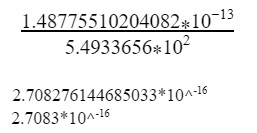

# Informe Tarea N°1
**Integrantes:**

Christian Bonifaz, Mateo Calderon, Josue Camacho, Luis Guevara

**NRC:** 5415

**Docente:** Ing. Darwin Alulema

**Tema:** Capitulo 1 (Introducción) y capitulo 2 (Voltaje y corriente) de Análisis de Circuitos - Robbins, Miller

### 1. OBJETIVOS
### 2. MARCO TEÓRICO

**CAPITULO 1 (Introducción)**

**CAPITULO 2 (Voltaje y corriente)**

### 3. EXPLICACIÓN Y RESOLUCIÓN DE EJERCICIOS O PROBLEMAS
**CAPITULO 1 (Introducción)**

**1) Realice las siguientes conversiones:**

**a) 27 minutos a segundos**

1 min = 60 s

27 min * 60s = 1620s

**b) 0.8 horas a segundos**

1 h = 3600s

0.8h * 3600s = 2880s

**c) 2 h 3 min 47 s a s**

2h * 3600s = 7200s

3 min * 60s = 180s

7200s + 180s + 47s = 7427s

**d) 35 caballos de potencia a watts**

35 c.potencia * 735 = 25725 watts

**e) 1827 W a hp**

1827 W / 746 = 2.45 hp

**f) 23 revoluciones a grados**

1 rev = 360 grados

23 rev * 360 grados = 8280 grados

**2) Realice las siguientes conversiones:**

**a) 27 pies a metros**

1 pie = 0,3048 m

27 pies * 0,3048 = 8,229 m

**b) 2.3 yd a cm**

1 yd = 91.44 cm

2.3 yd * 91.44 cm = 210.312 cm

**c) 36°F a °C**

(n°F - 32) * 5/9 = °C

(36°F - 32) * 5/9 = 2.222 °C

**d)18 galones(E.U) a litros**

1 galón = 3.78541 litros

18 galones * 3.785441 litros = 68.138 litros

**e) 100 pies cuadrados a m^2**

1 pie cuadrado = 0.092903 m^2

100 pies cuadrados * 0.092903m^2  = 9.2903 m^2

**f) 124 pulgadas cuadradas a m^2**

1 pulgada cuadrada = 0,00064516 m^2

124 pulgadas cuadradas * 0,00064516 m^2= 0.08m^2

**g) 47 libras fuerza a newtons**

1 lbf = 4,44822 N

47 lbf * 4,44822 N = 209.066 N

**3) Establezca los factores de conversión, calcule lo siguiente y exprese la respuesta en las unidades que se indican.**

**a) El área de una placa de 1.2 m por 70 cm en m^2.**

70 cm =70*0.01=0.7m

Area placa=Lado * Lado

1.2* 0.7= 0.84m^2

**b) El área de un triángulo con 25 cm de base, altura 0.5 m en m^2.**

25 cm = 25 * 0.01=0.25 m

área triángulo = (b* h)/2

(0.25* 0.5)/2=0.0625 m^2

**c) El volumen de una caja de 10 cm por 25 cm por 80 cm en m^3.**

10 cm= 10*0.01=0.1 m

25 cm= 25* 0.01=0.25 m

80cm= 80*0.01=0.8 m

V = 0.1x 0.25 * 0.8

V=0.02 m^3

**d) El volumen de una esfera de 10 pulgadas de radio en m^3.**

10 in *2.54cm=25.4 cm

25.4 cm * 0.01m= 0.254 m

V=4/3r3

V=4/3(0.254)^3

V=0.06864 m^3

**4) Un ventilador eléctrico gira a 300 revoluciones por minuto. ¿A cuánto equivale en grados por segundo?**

1 rpm = 6 grados por s

300 rpm * 6 grados por s = 1800 grados por s

**5) Si la máquina robot de montaje superficial de la figura 1-3 coloca 15 partes cada 12 s, ¿cuál es su tasa de colocación por hora?**

15* 5= 75 piezas por segundo

12 * 5=60s

75* 60=4500 piezas por hora

**6) Si su impresora láser puede imprimir 8 paginas por minuto, ¿cuántas páginas puede imprimir en una décima de hora?**

 8 páginas = 1 min
 
1 decima=60min / 10(décimas)= 6 min

 8 páginas = 1 min
 
   x   =  6 min 

x=8* 6=48 hojas

**7) Un auto tiene un rendimiento de 27 millas por galón (E. U.). ¿Cuál es el rendimiento en kilómetros por litro?**

1 milla por galón = 0,425144 km/litro

27 millas por galón * 0,425144 km/litro = 11.479 km/litro

**8) El radio ecuatorial de la Tierra es de 3963 millas. ¿Cuál es la circunferencia de la Tierra en kilómetros en el Ecuador?**

1 milla = 1,60934 km

3963 millas * 1.60934 km = 6377.815 km

**9) Una rueda gira 18° en 0.02 s. ¿A cuántas revoluciones por minuto equivale esta cantidad?**

1/0.02 = 50 veces en un segundo

18 * 50 = 900 grados por segundo

900 * 60 min = 54000 grados por minuto

54000/360 = 150 revoluciones por minuto

150 revoluciones por minuto

**10) La altura de los caballos se mide en ocasiones en “palmos” donde 1 palmo = 4 pulgadas. ¿Cuántos metros de altura mide un caballo de 16 palmos?, ¿y en centímetros?**

1 palmo = 4 pulgadas 

16 palmos * 4 pulgadas = 64 pulgadas

1 pulgada = 2.54 cm

64 pulgadas* 2.54 cm = 162.56 cm

**11) Se define la ecuación s=vt, donde s es la distancia recorrida, v es la velocidad y t es el tiempo. Si usted viaja a v= 60 mph por 500 segundos, obtiene y sustituye sin pensar s=  (60)(500) =30 000 millas. ¿Cuál es el error en este cálculo? ¿Cuál es la respuesta correcta?**

500s=500/3600=0.13889h

s=vt

s=60 milla/h * 0.13889h

s=8.3333 millas

El error que se comete en este cálculo es que el tiempo se encuentra en segundos y para realizar lo debería estar en horas.

*La respuesta es : s=8.3333 millas.* 

**12) Una pizza redonda tiene una circunferencia de 47 pulgadas. ¿Cuánto tiempo tardará en cortarla diagonalmente con un cortador de pizza que viaja a 0.12 m/s?**

47 in = 47/39.37= 1.19380m

t=1.19380/0.12

t=9.9484s

**13) A Joe S. se le pidió convertir 2000 yd/h en metros por segundo. Aquí está el trabajo de Joe: velocidad 2000 x 0.9144 x 60/60=1828.8 m/s. Determine los factores de conversión, escriba las unidades en la conversión y determine la respuesta correcta.**

1 yd/h = 0,000254 m/s

2000 yd/h * 0,000254 m/s = 0.508 m/s

**14) La distancia media de la Tierra a la Luna es 238 857 millas, Las señales de radio viajan a 299 792 458 m/s. ¿Cuánto tiempo tardan las señales de radio en llegar a la Luna?**

238857 millas= 238857* 1609=384320913 metros

R=d/t

299 792 458 m/s=384320913 m /t

t=1.281957s

**15) Si camina a una velocidad de 3 km/h por 8 minutos, 5 km/h por 1.25 h y luego continúa caminando a una velocidad de 4 km/h por 12 minutos, ¿qué distancia habrá caminado en total?**

8 min = 8/60 = 0.13h

12 min = 12/60 = 0.2h

0.13h x 3 km/h = 0.39km

0.2h x 4 km/h = 0.8km

1.25h x 5 km/h = 6.25 km

Distancia total = 0.39 + 0.8 + 6.25 = 7.44 km

**16) Suponga que camina a una velocidad de 2 mph por 12 minutos, 4 mph por 0.75 h, luego termina de caminar a 5 mph por 15 minutos, ¿qué distancia habrá caminado en total?**

12 min=12/60=0.2 h

15 min= 15/60 = 0.25h

0.2h * 2mi/h=0.4 mi

0.75h* 4 mi/h= 3 mi

0.25h* 5mi/h=1.25 mi

Distancia total = 0.4+3+1.25=4.65 mi

**17) Usted camina por 15 minutos a una velocidad de 2 km/h, luego 18 minutos a 5 km/h, y el resto del tiempo su velocidad es de 2.5 km/h. Si la distancia total que recorrió es de 2.85 km, ¿cuántos minutos caminó a 2.5 km/h?**

15 min= 15/60=0.25h 

18 min=18/60=0.3h

2.85=(0.25)(2)+(0.3)(5)+(2.5)t3

2.85=0.5+1.5+2.5t3

2.5t3=2.85-2

2.5km/h *t3=0.85km

t3=0.34h

**18) Usted camina por 16 minutos a una velocidad de 1.5 mph, acelera a 3.5 mph por un corto tiempo y disminuye a 3 mph para los últimos 12 minutos. Si la distancia total recorrida es de 1.7 millas, ¿cuánto tiempo caminó a 3.5 mph?**

16 min=16/60=4/15h

12min=12/60=0.2h

1.5=(4/15)(1.5)+(0.2)(3)+(3.5)t2

1.5=0.4+0.6+3.5t2

3.5 mi/h* t2=0.5 mi

t2=1/7 h

t2=0.14286 h

**19) Su jefe de planta le pide investigar dos máquinas. El costo de electricidad para la operación de la máquina # 1 es 43 centavos/minuto, mientras que para la máquina # 2 es de $200.00 por turno de 8 horas. El precio de compra, la capacidad de producción, los costos de mantenimiento y la confiabilidad a largo plazo de ambas máquinas son idénticos. Con base en esta información, ¿qué máquina debería comprar y por qué?**

Máquina # 1

43 ctvs * minuto

1440 min = 1 día

43* 1440 = 61920 ctvs

61920/100 = 619.2 dólares por dia

Máquina # 2

200 por turno

3 turnos = 24 horas

200* 3=600 dolares por dia

La opción 2 conviene puesto que cuesta menos y puede generar mayor ganancia.

**20) Dado que 1 hp=550 ft-lb/s, 1 ft=0.3048 m, 1 lb=4.448 N, 1 J=1 N-m y 1 W=1 J/s, demuestre que 1 hp=746 W**.

**21) Exprese cada unas de las siguientes cantidades en notación de potencias de diez con un dígito diferente de cero a la izquierda del punto decimal:**

**a) 8675**

8.675 * 10^3

**b) 0.00872**

 8.72 * 10^-3

**c) 12.4 x 10^2**

1.24 * 10^3

**d) 37.2 x 10^-2**

3.72 * 10^-1

**e) 0.00348 x 10^5**

3.48 * 10^2

**f)0.000215 x 10^-3**

2.15 * 10^-7

**g)14.7 x 10^0**

1.47 * 10^1

**22)  Exprese las respuestas de cada unas de las siguientes cantidades en notación de potencias de diez con un dígito diferente de cero a la izquierda del punto decimal:**

**a) (17.6)(100)**

1760

1.76 * 10^3

**b) (1400)(27 x 10^-3)**

37.8

3.78 * 10^1

**c) (0.15 x 10^6)(14 x 10^-4)**

210

2.1 * 10^2

**d) 1 x 10^-7x 10^-4 x 10.65**

1.065 * 10^-10

**e) (12.5)(1000)(0.01)**

125

1.25 * 10^2

**f) (18.5x 10^0)(100)(1.5x10^-5)(0.001)**

2.775 * 10^-5

**23) Repita las instrucciones de la pregunta 22 para las siguientes cantidades.**

**a)125/1000**

1.25 * 10^-1

**b)(8 * 10^4)/(0.001)**
 80 000000 
8 * 10^7

**c)(3 * 10^4)/(1.5 * 10^6)**

3/15 * 10^4/10^6

2 * 10^-2

**d)[(16 * 10^-7)(21.8 * 10^6)]/[(14.2)(12 * 10^-5)]**

43 60000/213

2.04694835680751 * 10^4

**24) Determine el resultado de las siguientes operaciones**

**a) 123.7+0.05+1259x10^-3** 

125.009

**b) 72.3x10^-2+1x10^-3**

0.724

**c) 86.95x10^2-383**

8309

**d)452x10^-2+(697)(0.01)**

11.49

**25) Convierta las siguientes cantidades a notación de potencias de 10, y sin usar la calculadora determine las respuestas.**

**a)(4x10^3)(0.05)^2**

(4 * 10^3)(0.0025)

(4 * 10^3)(2.5 * 10^3)

(4 * 2.5)(10^3 * 10^3)

10 * 10^6

**b)(4x10^3)(-0.05)^2**

(4 * 10^3)(0.0025)

(4 * 10^3)(2.5 * 10^3)

(4 * 2.5)(10^3x10^3)

10 * 10^6

**c)[(3 x 2 * 10) ^2] / [(2 x5 x 10^-1)]**

**d)[( 30+20)^-2(2 x 10^6 )(6000)]/[(1 x 10^3)(2 x 10^-1)^2]**

**e) [(-0.027)^1/3 (-0.2)^2]/[(23+1)^0 x 10^-3]**

**26) Para cada una de las siguientes cantidades convierta los números a notación de potencias de diez, después realice los cálculos que se indican. Redondee su respuesta a cuatro dígitos:**

**a)(452)(6.73x10^4)**

(4.52 x 10^2)(6.73 x 10^4)

3.04196 x 10^7

3.042 x 10^7

**b)(0.00985)(4700)**

(9.85x10^-3)(4.7x10^3)

4.629x10^1

**c)(0.0892)/(0.0000673)**

**d)12.40-236 x 10^-2**
10.04

1.004x10^1

**e)(1.27)^3+47.9/(0.8)^2**

76.892133

7.6892133x10^1

7.6892x10^1

**f)(-643x10^-3)^3**

-0.265847707

-2.6585x10^-1

**g)[ (0. 0025) ^1/2] * [1.6x10^4]]**

(5x10^-2)x(1.6x10^4)

8x10^2

**h)[(-0.027)^1/3]/[1.5x10^-4]**

**i)[(3.5 x 10^4)^-2 (0.0045)^2(729)^1/3]/([(0.00872 * (47)^3)]-356)**

**CAPITULO 2 (Voltaje y corriente)**

**1. ¿Cuántos electrones libres a temperatura ambiente hay en los siguientes elementos?**

a. 1 metro cúbico de cobre =10^29

b. Un alambre de cobre de 5 metros de longitud cuyo diámetro es 0.163 cm =10,4*10^23

**3. Dos cargas están separadas por cierta distancia. Si la magnitud de una carga se duplica y la otra se triplica y la distancia entre ellas se reduce a la mitad, ¿cómo se ve afectada la fuerza?**

Se incrementa por un factor de 24.

**4. Cierto material tiene 4 electrones en su capa de valencia y un segundo material tiene 1. ¿Cuál es mejor conductor?**

El que tiene 4 electrones, Entre mayor sean los electrones de valencia mayor conductividad tiene el material

**5. a. ¿Qué hace que un material sea buen conductor? (En su respuesta considérelas capas de valencia y los electrones libres.)**

Material con muchos electrones libres (es decir, material con 1 electrón en la capa de valencia).

b. Además de ser un buen conductor, mencione otras dos razones por las que el cobre es ampliamente usado.

No es costoso y forma alambres con facilidad.

c. ¿Qué hace que un material sea buen aislante?

La capa de valencia está llena, por tanto, no hay electrones libres.

d. Normalmente el aire es un aislante; sin embargo, durante las descargas de rayos hay conducción. Discuta brevemente el mecanismo de flujo de carga en esta descarga.

La gran fuerza eléctrica arranca los electrones de la órbita.

**6. a. Aunque el oro es muy caro, en ocasiones se usa en electrónica como recubrimiento en contactos. ¿Por qué?**

Porque es mucho mejor conductor que otros materiales como el cobre, y por ende permiten mejor la transmisión de información.

b. ¿Por qué algunas veces se usa el aluminio cuando su conductividad es sólo 60% de la del cobre?

Porque el aluminio es mucho más fácil de manejar y es mas ligero que el cobre.

**7.Calcule la fuerza eléctrica entre las siguientes cargas y establezca cuándo es de atracción y cuándo de repulsión.**

a. Una carga de +1µC y una carga de +7µC, separadas 10 mm

b. Q1=8µC y Q2=-4µC, separados por 12cm

c. Dos electrones separados 12* 10^(-8) m

d. Un electrón y un protón separados 5.3* 10^(-11) m

e. Un electrón y un neutrón separados 5.7* 10^(-11) m

El neutrón no posee carga, por lo tanto, F= 0 

**8. ¿Qué significado tiene decir que un cuerpo está “cargado”?**

Significa que un cuerpo ha perdido o ganado electrones, En el caso de que un cuerpo tenga más electrones que protones se dice que está cargado negativamente, y en el caso contrario el cuerpo de encuentra cargado positivamente.

**9. La fuerza entre dos cargas, una positiva y una negativa, separadas 2 cm es de 180N. Si Q1=4µC. ¿Cuánto vale Q2? ¿la fuerza es de atracción o de repulsión?**

**10. Si se pudiera colocar una carga de 1 C en cada uno de dos cuerpos que están separados 25 cm de centro a centro, ¿cuál sería la fuerza entre ellas en newtons?,¿y en toneladas?**

**11. La fuerza de repulsión entre dos cargas separadas 50 cm es de 0.02 N. Si Q_2=5Q_1, determine las cargas y su posible signo.**

**12. ¿Cuántos electrones representa una carga de 1,63µC?**

**13. Determina la carga en 19 * 10^13 electrones**

**14. Una placa de metal eléctricamente neutra adquiere una carga negativa de 47µC. ¿Cuántos electrones se le agregaron?**

**15. A una placa de metal se le han adicionado 14,6 * 10^13 electrones y posteriormente se le agrega una carga de 1,3 µC. Si la carga final en la placa es de 5,6µC, ¿cuál fue la carga inicial?**

**16. Al deslizar una silla y tocar algún objeto puede provocar un choque eléctrico. Explique por qué.**

Porque al realizar eso hacemos fricción y mediante aquello generamos corriente electroestática

**17. Si se requieren 360 Joules de energía para transferir 15 C de carga a través de la lámpara de la figura 2-1, ¿cuál es el voltaje de la batería?**

**18. Si se requiere de 600 J de energía para mover 9.36 * 10^19 electrones de un punto a otro, ¿cuál es la diferencia de potencial entre los dos puntos?**

**19. Si se requiere de 1.2 kJ de energía para mover 500 mC de un punto a otro, ¿cuál es el voltaje entre los dos puntos?**

**20. ¿Cuánta energía se requiere para mover 20 mC de carga a través de la lámpara de la figura 2-23?**

W=(20 * 10^(-3) C)(47,2V)=0,944J

**21. ¿Cuánta energía adquiere una carga de 0,5µC conforme se mueve a través deuna diferencia de potencial de 8.5 kV?**

W=(0,5 * 10^(-6) C)(8,5 * 10^3 V)=4,25mJ

**22. Si el voltaje entre dos puntos es de 100 V, ¿cuánta energía se requiere para mover un electrón entre los dos puntos?**

W=(1,6 * 10^(-19) C)(100V)=1,6*10^(-17) J

**23. Dado un voltaje de 12 V para la batería de la figura 2-1, ¿cuánta carga se mueve a través de la lámpara si se requieren 57 J de energía para moverla?**

**24. Para el circuito de la figura 2-1, si 27 C pasan a través de la lámpara en 9 segundos, ¿cuál es la corriente en amperes?**

### 4. VIDEO
### 5. CONCLUSIONES 
### 6. BIBLIOGRAFÍA

