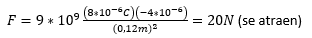

# Informe Tarea N°1
**Integrantes:**

Christian Bonifaz, Mateo Calderon, Luis Eduardo, (Integrante 4)

**NRC:** 5415

**Docente:** Ing. Darwin Alulema

**Tema:** Capitulo 1 (Introducción) y capitulo 2 (Voltaje y corriente) de Análisis de Circuitos - Robbins, Miller

#### 1. OBJETIVOS
#### 2. MARCO TEÓRICO

**CAPITULO 1 (Introducción)**

**CAPITULO 2 (Voltaje y corriente)**

#### 3. EXPLICACIÓN Y RESOLUCIÓN DE EJERCICIOS O PROBLEMAS
**CAPITULO 1 (Introducción)**

**CAPITULO 2 (Voltaje y corriente)**

**1. ¿Cuántos electrones libres a temperatura ambiente hay en los siguientes elementos?**

a. 1 metro cúbico de cobre =10^29

b. Un alambre de cobre de 5 metros de longitud cuyo diámetro es 0.163 cm =10,4*10^23

**3. Dos cargas están separadas por cierta distancia. Si la magnitud de una carga se duplica y la otra se triplica y la distancia entre ellas se reduce a la mitad, ¿cómo se ve afectada la fuerza?**

Se incrementa por un factor de 24.

**4. Cierto material tiene 4 electrones en su capa de valencia y un segundo material tiene 1. ¿Cuál es mejor conductor?**

El que tiene 4 electrones, Entre mayor sean los electrones de valencia mayor conductividad tiene el material

**5. a. ¿Qué hace que un material sea buen conductor? (En su respuesta considérelas capas de valencia y los electrones libres.)**

Material con muchos electrones libres (es decir, material con 1 electrón en la capa de valencia).

b. Además de ser un buen conductor, mencione otras dos razones por las que el cobre es ampliamente usado.

No es costoso y forma alambres con facilidad.

c. ¿Qué hace que un material sea buen aislante?

La capa de valencia está llena, por tanto, no hay electrones libres.

d. Normalmente el aire es un aislante; sin embargo, durante las descargas de rayos hay conducción. Discuta brevemente el mecanismo de flujo de carga en esta descarga.

La gran fuerza eléctrica arranca los electrones de la órbita.

**6. a. Aunque el oro es muy caro, en ocasiones se usa en electrónica como recubrimiento en contactos. ¿Por qué?**

Porque es mucho mejor conductor que otros materiales como el cobre, y por ende permiten mejor la transmisión de información.

b. ¿Por qué algunas veces se usa el aluminio cuando su conductividad es sólo 60% de la del cobre?

Porque el aluminio es mucho más fácil de manejar y es mas ligero que el cobre.

**7.Calcule la fuerza eléctrica entre las siguientes cargas y establezca cuándo es de atracción y cuándo de repulsión.**

a. Una carga de +1µC y una carga de +7µC, separadas 10 mm

b. Q1=8µC y Q2=-4µC, separados por 12cm

c. Dos electrones separados 12* 10^(-8) m

d. Un electrón y un protón separados 5.3* 10^(-11) m

e. Un electrón y un neutrón separados 5.7* 10^(-11) m

El neutrón no posee carga, por lo tanto, F= 0 

**8. ¿Qué significado tiene decir que un cuerpo está “cargado”?**

Significa que un cuerpo ha perdido o ganado electrones, En el caso de que un cuerpo tenga más electrones que protones se dice que está cargado negativamente, y en el caso contrario el cuerpo de encuentra cargado positivamente.

**9. La fuerza entre dos cargas, una positiva y una negativa, separadas 2 cm es de 180N. Si Q1=4µC. ¿Cuánto vale Q2? ¿la fuerza es de atracción o de repulsión?**

**10. Si se pudiera colocar una carga de 1 C en cada uno de dos cuerpos que están separados 25 cm de centro a centro, ¿cuál sería la fuerza entre ellas en newtons?,¿y en toneladas?**

**11. La fuerza de repulsión entre dos cargas separadas 50 cm es de 0.02 N. Si Q_2=5Q_1, determine las cargas y su posible signo.**

**12. ¿Cuántos electrones representa una carga de 1,63µC?**

**13. Determina la carga en 19 * 10^13 electrones**

**14. Una placa de metal eléctricamente neutra adquiere una carga negativa de 47µC. ¿Cuántos electrones se le agregaron?**

#### 4. VIDEO
#### 5. CONCLUSIONES 
#### 6. BIBLIOGRAFÍA

